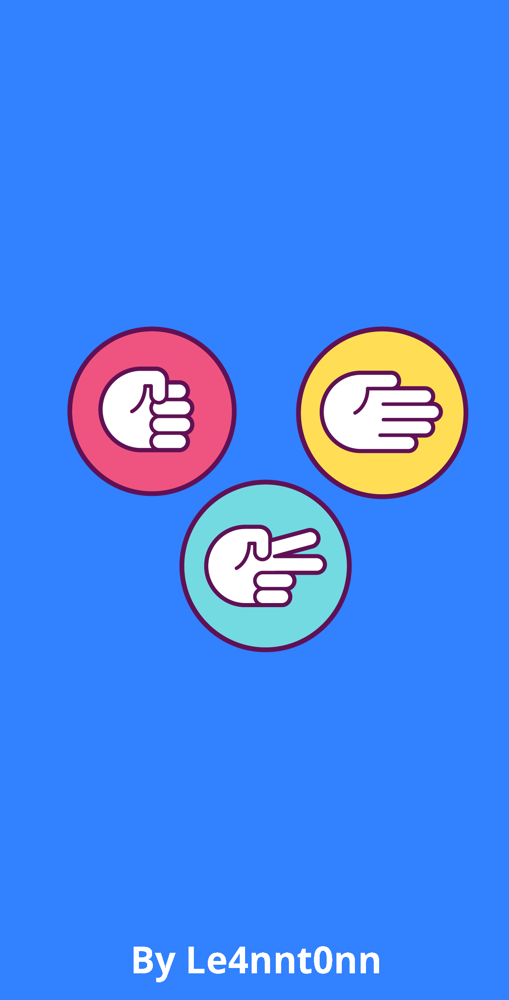
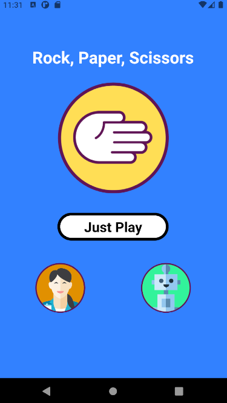
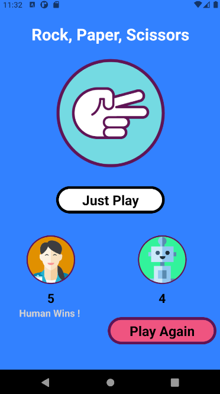

## Rock, Paper & Scissors

 > Rock, Paper & Scissors game using React Native and Expo. (Android)

 ***

 

    <h3>[ RPS 🌑🧻✂ ]<h3>
    <h5>Check it in 🔍</h5>
    <h3>
         | 
         <a href="https://expo.dev/accounts/le4nnt0nn/projects/rps-rn/builds/ee949d79-21c5-4879-a39d-22d2fe684457">
            Expo
        </a>
         | 
        <a href="https://expo.dev/@le4nnt0nn/rps-rn">
            ExpoApp
        </a>
         | 
        <a href="https://mega.nz/file/1BwWhACJ#IL8e6Fi_RLTdbjhhJ8wmLnScJx3ronrK8pLHihjHOhA">
            Mega (APK)
        </a>
         | 
    </h3>
    

   
***

### 📄 About 

A game created using React Native, Expo and Android Studio. 

### 🚀 Launch

Download and intall the apk in your Virtual Device (Android) or check it with Expo App.

***

### 🧪 Technologies

Used [React Native](https://reactnative.dev/ "React Native Documentation").

### 📋 Features

* You are the human and you play against COM (1 player game)
* The first to reach 5 points win the game 
* When the game finished, a Play Again button appears
 
### 📷 Templates

#### Init App View (Splash)

   

     
#### Game View
     
     
#### Win Game View (Humans Win! Yay!)

